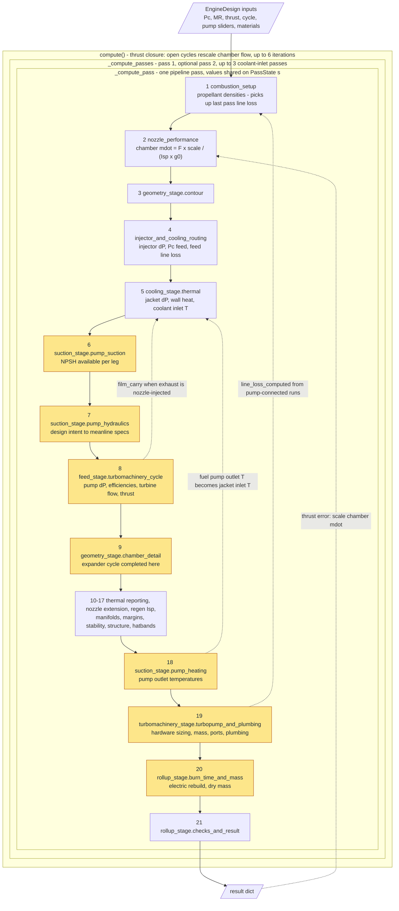
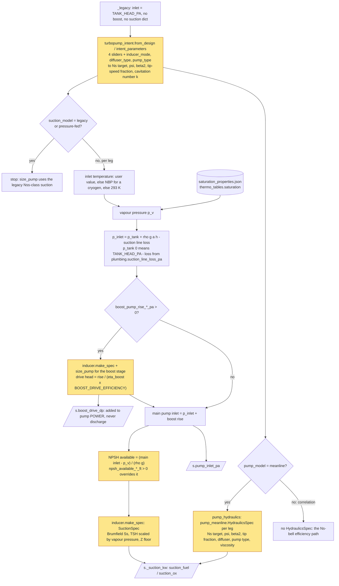
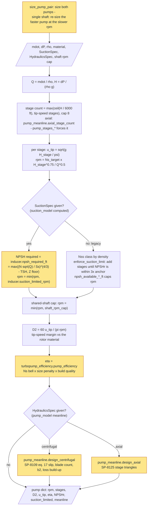
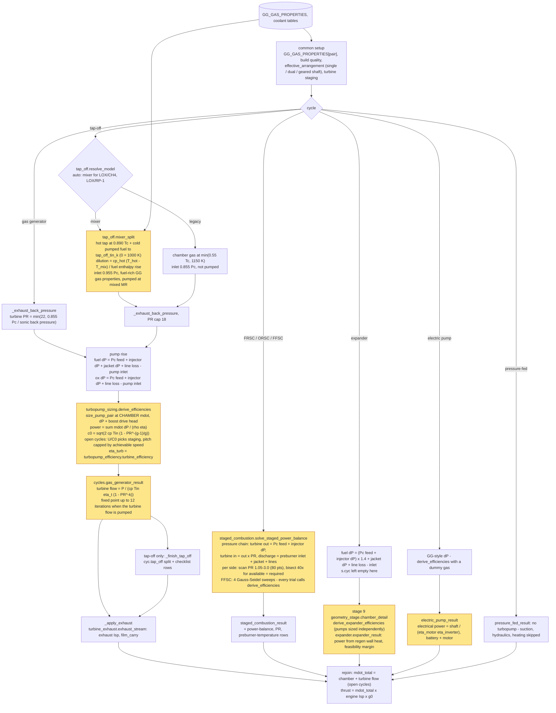
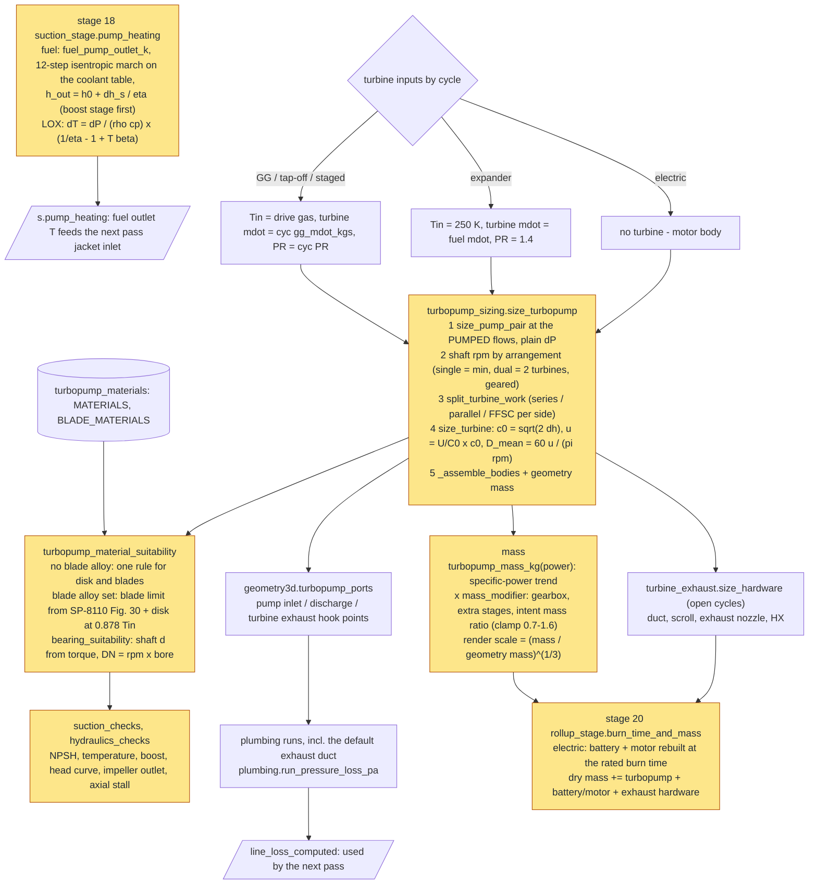
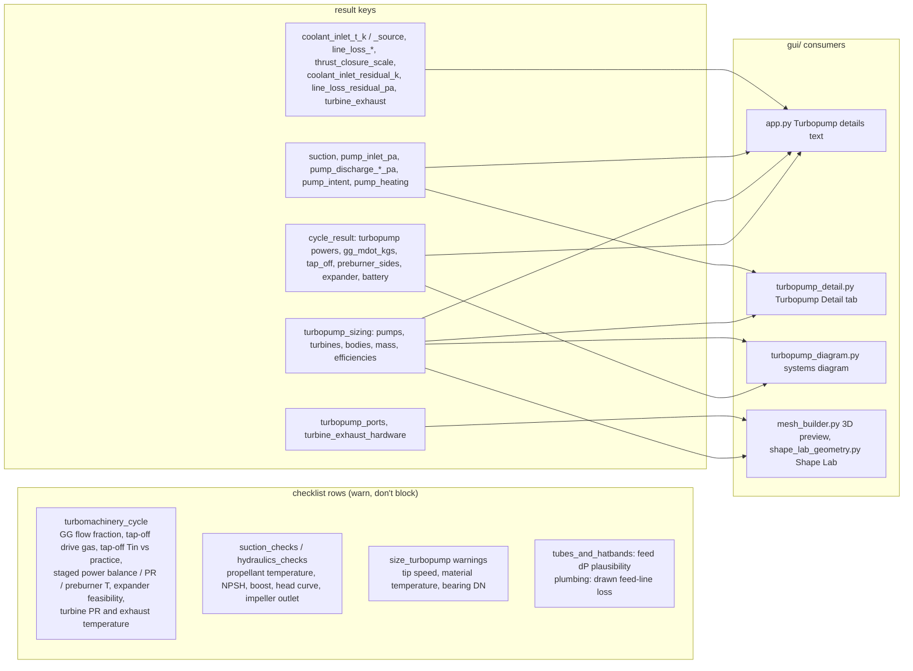

# Turbopump calculation flow

As of 2026-09-27: `main` with turbopump Rounds 0-2 and the tap-off accuracy round (PRs #21, #22).

This is a map of **what the turbopump maths does, in what order, and what feeds back into what**
inside one `EngineDesign.compute()` call. Boxes name **file · function** (paths under
`engine_designer/physics/` unless marked `gui/`). Line numbers are left out because they drift.
Each box also carries the one-line model it evaluates.

For the *numbers* (constants, tiers, sources) see `ASSUMPTIONS.md`. For the cooling side that
feeds the pumps, see `COOLING_AUDIT.md`. **Update this file whenever a turbopump round changes
the chain.**

Diagram legend (GitHub renders the Mermaid blocks):

| Shape / colour | Meaning |
|---|---|
| amber box | turbopump-relevant stage or function |
| diamond | a model switch or cycle branch |
| cylinder | a baked table or catalogue that is read |
| dashed arrow | a value fed back into the **next** pass or iteration |

Contents:
1. [Overview and outer loops](#1-overview-and-outer-loops)
2. [Suction and hydraulics inputs](#2-suction-and-hydraulics-inputs)
3. [Inside size_pump](#3-inside-size_pump)
4. [Cycle branches](#4-cycle-branches-the-power-balance)
5. [Final hardware sizing, pump heating, rollup](#5-final-hardware-sizing-pump-heating-rollup)
6. [Outputs](#6-outputs)
7. [Model switches](#7-model-switches)
8. [Loops and iterations](#8-loops-and-iterations)
9. [Known quirks found while tracing](#9-known-quirks-found-while-tracing)

---

## 1. Overview and outer loops

**What triggers pass 2** (`EngineDesign._compute_passes`), in any combination:
- a plumbing run connected to a pump port produced `line_loss_computed`. It is consumed by
  `combustion_setup` and, for the exhaust duct, by `feed_stage._exhaust_back_pressure`;
- nozzle-injected turbine exhaust produced a `film_carry`, consumed by `cooling_stage.thermal`;
- `coolant_inlet_model = "computed"` with `pump_model = "meanline"`, where the fuel-pump outlet
  differs from the jacket inlet used by more than `COOLANT_INLET_TOLERANCE_K` (0.5 K).

If the coolant inlet triggered it, up to 3 more passes run. Each is under-relaxed as
T = ½(T + T_new), and the loop stops once both the inlet and the film flow are stable.

---

## 2. Suction and hydraulics inputs

Stages 6 and 7 (`design/suction_stage.py`). These produce the pump **inlet pressure** that every
pump dP starts from, the **boost-pump drive head** charged to pump power, and the per-leg specs
`size_pump` is later called with.

---

## 3. Inside size_pump

`turbopump_sizing.size_pump` is called for every pump, many times per pass:
- the power balance (§4), via `size_pump_pair`;
- each staged-solver trial;
- the boost pump;
- the final hardware sizing (§5).

It is exact-arg cached on the meanline side (`pump_meanline._exact_cache`).

When the meanline runs, its `eta` replaces the correlation value, which is kept as
`eta_correlation`.

---

## 4. Cycle branches: the power balance

Stage 8, `design/feed_stage.turbomachinery_cycle`. Every turbopump cycle shares the same core:

Notes:
- The efficiency calls always use **dP + boost drive head**, so the boost pump's drive head is
  charged to pump power.
- The staged solver is the expensive path: each PR trial fully re-sizes both pumps, including
  the meanline.

---

## 5. Final hardware sizing, pump heating, rollup

Stages 18-20. The power balance fixed the efficiencies, powers and turbine flow. This part
builds the machine, its mass and its ports, then works out how hot the pumped propellant leaves.

The reported pump and turbine efficiencies are the **power-balance** values from §4. The
`size_turbopump` re-size is used for geometry, rpm and ports (see quirk 1).

---

## 6. Outputs

The turbopump mass rolls into `computed_dry_mass_kg`. `structure_stage.tubes_and_hatbands` first
sets a provisional value, which `turbopump_and_plumbing` replaces.

---

## 7. Model switches

| Field | Values (default first) | What it changes | Where (§) |
|---|---|---|---|
| `suction_model` | computed / legacy | computed: tank → line → boost → NPSHa, inducer NPSHr caps rpm, pump heating on. Legacy: `TANK_HEAD_PA` inlet, Nss class, no boost, no heating (so no computed coolant inlet) | 2, 3, 5 |
| `pump_model` | meanline / correlation | meanline: `HydraulicsSpec`, meanline efficiency, intent mass ratio, computed coolant inlet possible. Correlation: Ns-bell efficiency (the Round 1 path) | 2, 3, 1 |
| `pump_type_fuel/ox` | auto (= centrifugal) / centrifugal / axial | axial: scaled Ns target and psi, `axial_stage_count`, `design_axial`, axial stall row | 3 |
| `pump_priority`, `pump_head_curve`, `suction_aggressiveness`, `tip_speed_aggressiveness` | −1 … +1, 0 = neutral | Ns target, psi, beta2, tip-speed fraction, cavitation number | 2 |
| `inducer_mode`, `diffuser_type` | auto / on / off; auto / volute / vaned | inducer off = the no-inducer Ss (`SS_NO_INDUCER`); volute vs vaned diffuser losses | 2, 3 |
| `tap_off_model` | auto / mixer / legacy | auto = mixer for LOX/CH4 + LOX/RP-1, legacy otherwise. Mixer: 1,000 K fuel-rich gas, 0.955 Pc, pumped dilution | 4 |
| `tap_off_tin_k` | 0 = 1,000 K | mixer turbine inlet temperature (legacy: overrides the 0.55 Tc / 1150 K rule) | 4 |
| `coolant_inlet_model` | computed / table | computed: fuel pump outlet T becomes the jacket inlet (extra passes) | 1, 5 |
| `turbine_staging` | auto / a named staging (e.g. single_impulse, velocity_compounded_2row) | open cycles: auto staging from the achievable U/C0; closed cycles: the rule-based staging | 4 |
| `turbopump_arrangement` | auto / single_shaft / dual_shaft / geared | shared-shaft rpm cap, number of turbines, work split, gearbox mass | 3, 4, 5 |
| `turbine_exhaust_mode` | overboard_duct / aspirator / nozzle_injection | turbine back pressure (PR), exhaust Isp, film carry (pass 2) | 1, 4 |
| `turbine_blade_material_key` | "" = same as turbopump material | splits the temperature check into blade + disk | 5 |
| `eta_pump_fuel/ox`, `pump_stages_fuel/ox`, `enforce_suction_limit`, `npsh_available_*_ft` | 0 = derived | pin the pump efficiency / stage count; legacy suction options; NPSHa override | 2, 3, 4 |

---

## 8. Loops and iterations

Listed innermost first.

| Loop | Where | Converges on | Cap / tolerance |
|---|---|---|---|
| Legacy suction stage-add | `size_pump` (legacy + `enforce_suction_limit`) | NPSHr within 3× the anchor | 8 stages |
| Shared-shaft re-size | `size_pump_pair` | both pumps at one rpm | one re-size |
| Pumped turbine flow | `cycles.gas_generator_result` | GG / mixer flow that is itself pumped | 12 iterations, 1e-6 relative (1 iteration if not pumped) |
| Staged PR search | `staged_combustion.solve_staged_power_balance` | PR where turbine power available = required | 80-point scan + 40 bisections per side; FFSC 4 sweeps |
| Pass 2 | `_compute_passes` | pump-connected line loss, exhaust film, coolant inlet | one pass; line loss only reports a residual after it |
| Coolant-inlet passes | `_compute_passes` | jacket inlet T = fuel pump outlet T, stable film flow | 3 more passes, 0.5 K, under-relaxed ½ |
| Thrust closure | `compute()` | chamber + exhaust thrust = target (open cycles) | 6 iterations, 1e-9 |

Worst case: 6 thrust iterations × 5 passes = 30 full pipeline passes. Staged-combustion designs
are the slow ones, because the PR search re-sizes the pumps at every trial.

---

## 9. Known quirks found while tracing

These are recorded here for a decision; they were **not** changed in this documentation round.

1. **Two different pump sizings.** `derive_efficiencies` sizes the pumps at the **chamber** flow
   with **dP + boost drive head**. `size_turbopump` re-sizes them at the **pumped** flow (which
   includes the GG / mixer draw) with **plain dP**. So the drawn machine's rpm and D2 are not
   exactly the machine that set the efficiencies used in the power balance.
2. **The expander efficiency path ignores the shaft arrangement.** `derive_expander_efficiencies`
   sizes the pumps independently, while `size_turbopump` then applies the shared-shaft cap.
3. **Coolant-inlet pass count.** `COOLANT_INLET_MAX_EXTRA_PASSES = 2` is commented "beyond the
   first corrective pass", but the loop is `range(2 + 1)`, which allows 3.
4. **Stale docstring.** `derive_efficiencies` says "a short back-substitution (<=3 passes)", but
   the code runs a single pass.
5. **The pitchline cap only reaches the fuel turbine.** `size_turbopump` passes
   `u_pitch_max_m_s` to the fuel turbine only, so a dual-shaft ox turbine is uncapped.
